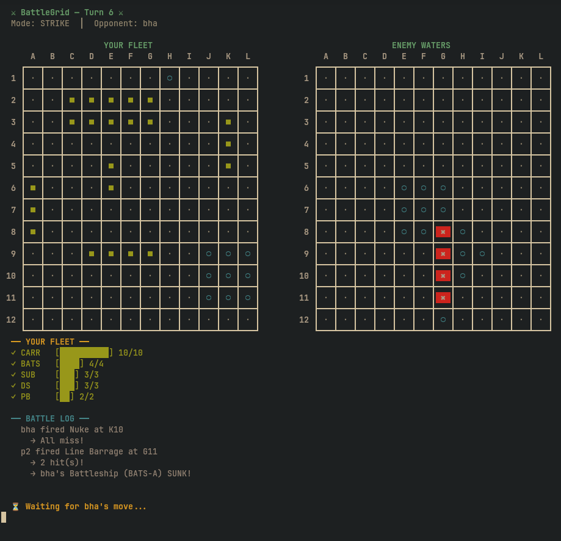
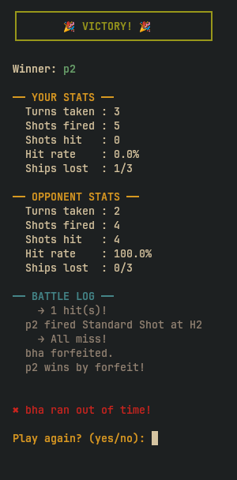

# BattleGrid

A terminal-based multiplayer battleship game built in Java, played over encrypted WebSocket connections.

Two players connect to a central server, deploy ships on a grid, and take turns firing at each other using various weapon types. Ships are placed randomly, and losing a ship means losing access to its unique weapon.

## Features

- **Encrypted multiplayer** — RSA key exchange + AES-encrypted game traffic over WebSockets
- **3 Game Modes** — Blitz, Strike, and War Mode with different map sizes and fleet compositions
- **Weapon variety** — Different ship classes unlock different weapons (1×1, 1×3, plus-shaped, nuke)
- **Cooldown system** — Powerful weapons have turn-based cooldowns
- **Terminal UI** — Entire game runs in the terminal with ASCII grid rendering

## Screenshots 





## Prerequisites

- **Java 21+**
- **Maven 3.8+**
- **Make** (optional, for development convenience)

## Quick Start

### Build the project

```sh
make sync
```

or directly:

```sh
mvn clean install
```

### Start the server

```sh
make server
```

The server starts on port `8025` and prints the LAN IP address clients can connect to.

### Start a client

In a separate terminal (can be on a different machine on the same network):

```sh
make client
```

You will be prompted for:
1. The server IP address (e.g., `192.168.1.5` or `localhost`)
2. Your username

Once two players are connected, the server initiates the game.

### Run tests

```sh
make test
```

## How It Works

1. **Connection** — Client connects to the server via WebSocket (`ws://<ip>:8025/websockets/battlegrid`)
2. **Handshake** — Server sends its RSA public key → Client generates an AES key, encrypts it with the server's public key, and sends it back with a username → All further communication is AES-encrypted
3. **Lobby** — Server waits for two players. Once both are connected, the server assigns a game mode (or uses a default) and generates randomized ship placements for both players
4. **Gameplay** — Players take turns selecting a weapon and target coordinates. The server validates moves, resolves hits/misses/sinks, and broadcasts updated state
5. **End** — Game ends when all ships of one player are sunk. The server announces the winner

## Game Modes

| Mode   | Grid Size | Ships | Match Length |
|--------|-----------|-------|--------------|
| Blitz  | 8×8       | 3     | ~5 min       |
| Strike | 12×12     | 5     | ~15 min      |
| War    | 16×16     | 7     | ~30 min      |

## Ship Classes & Weapons

| Ship Class  | Size | Weapon          | Pattern                  | Cooldown |
|-------------|------|-----------------|--------------------------|----------|
| Patrol Boat | 2    | Standard Shot   | 1×1 single tile          | None     |
| Submarine   | 3    | Standard Shot   | 1×1 single tile          | None     |
| Destroyer   | 3    | Line Barrage    | 1×3 horizontal/vertical  | 2 turn   |
| Battleship  | 4    | Cross Bomber    | Plus shape (5 tiles)     | 3 turn   |
| Carrier     | 5    | Nuke            | 3×3                      | 5 turns  |

> Every ship always has access to the basic 1×1 Standard Shot with no cooldown, ensuring a player can always fire even if all special weapons are on cooldown.

## License

[LICENSE](./LICENSE)
